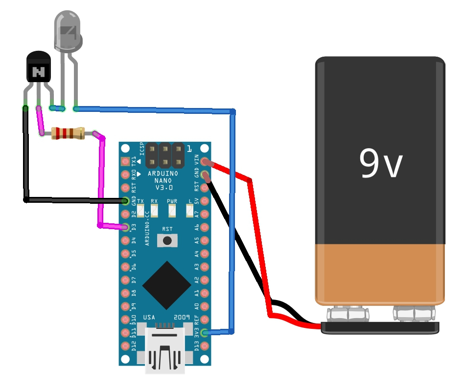

Circuito básico para armar el matateles, el resto de los led se conectan de la misma manera. Para poder prender y apagar el matateles podemos agregar un interruptor a la batería de 9v.

https://maquinaslibres.noblogs.org/matateles/
